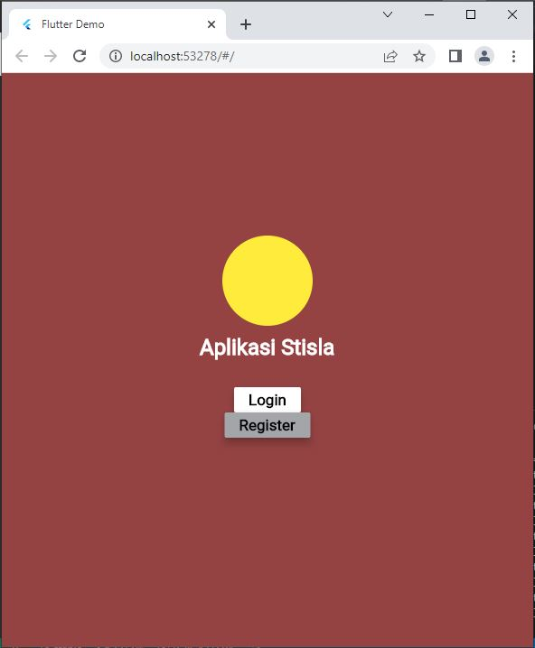
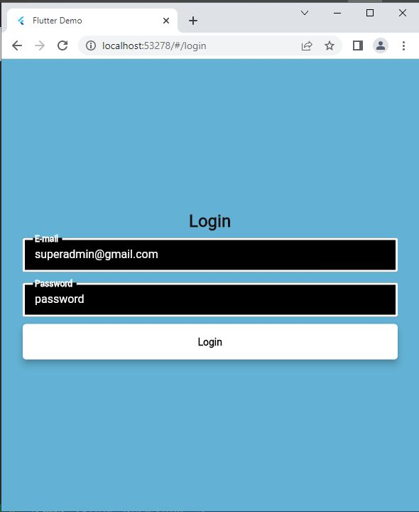
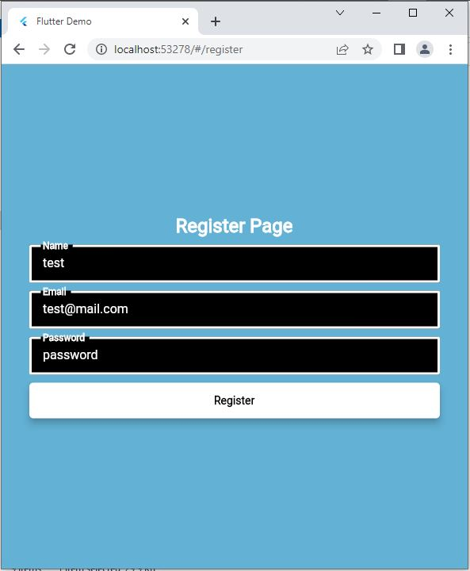
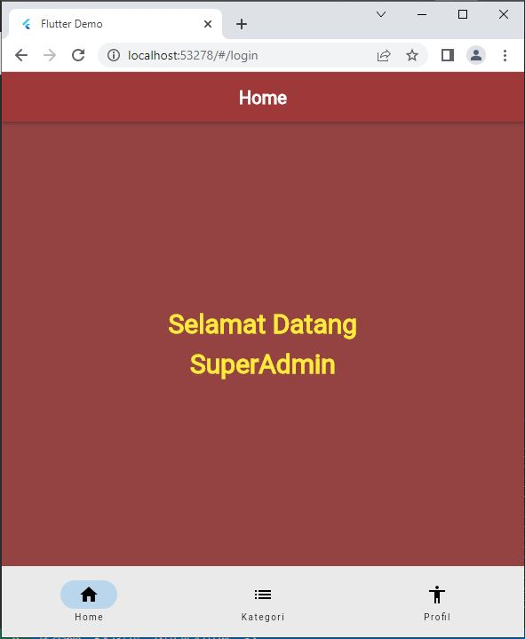
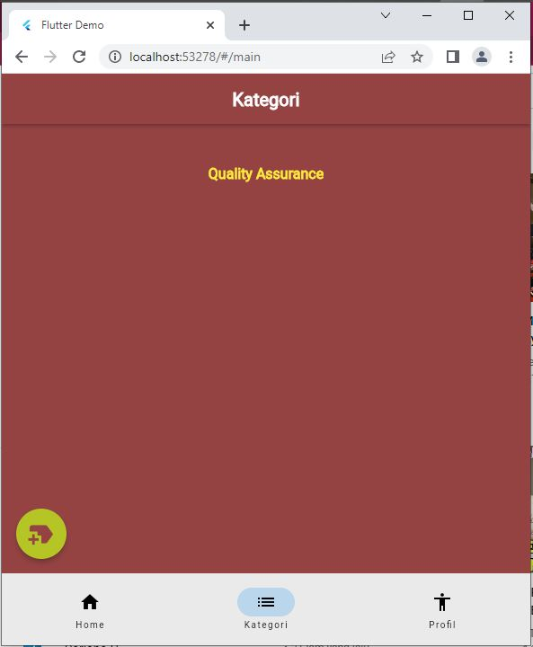
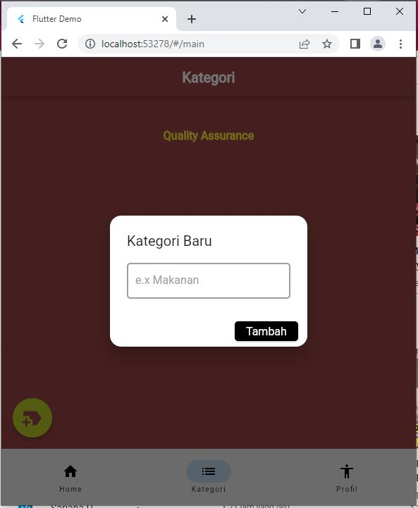
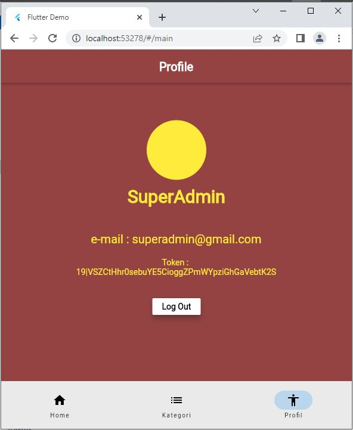
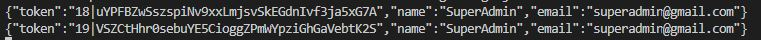

# Hasil Ujian Akhir Semester

1. Tampilan awal

2. Tampilan login

3. Tampilan register

4. Home

5. Kategori

6. Tambah Kategori

7. Hapus Kategori

8. Edit Kategori

9. Profile dan Logout

10. Token
